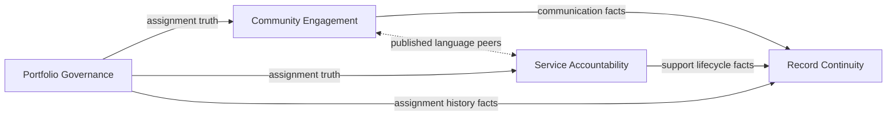

# Integration Boundaries

## Responsibility Boundaries At The Seams

| Seam | Upstream (owns the meaning) | Downstream (consumes or extends) | Integration rule |
| --- | --- | --- | --- |
| **Assignment truth** | `Portfolio Governance` | `Community Engagement`, `Service Accountability` | Conform to authoritative `Administrator assignment`; no parallel “current responsibility” source. |
| **Community-facing participation** | `Community Engagement` | `Service Accountability` (peer) | Exchange glossary-aligned facts only; do not merge public communication and case lifecycle. |
| **Support accountability** | `Service Accountability` | `Community Engagement` (peer) | May reference communications as context; must not redefine support as discussion. |
| **Historical evidence** | Operational contexts (as originators of facts) | `Record Continuity` | Consume and preserve; do not drive live assignment or open-case authority. |
| **Operator governance** | `Portfolio Governance` | EchoCorner as a whole | Portfolio decisions precede operational reliance on new assignment truth. |

## Translation And Anti-Corruption

Chapter 09 notes that `Record Continuity` may need a **narrow translation** when retention or legal meaning diverges from day-to-day operating vocabulary.

- **Anti-corruption (targeted):** Protect the continuity model from leaking operational shortcuts back into governance or case handling. Translation belongs at the **continuity boundary**, not at the assignment boundary—assignment meaning must not be “reinterpreted” away from `Portfolio Governance`.
- **Operational contexts:** Should avoid building local glossaries for `Administrator assignment` that differ from the portfolio; that would violate Conformist integration with the governance supplier.

## What Is Explicitly Not Integrated At This Stage

Aligned with chapter 08 non-goals and chapter 09 boundary discipline:

| Not integrated now | Rationale |
| --- | --- |
| **Concrete APIs, topics, queues, or schemas** | Out of scope for integration architecture; preserves freedom for application and platform chapters. |
| **Identity, tenancy, and access-control enforcement** | Security integration is deferred; only business accountability seams are described here. |
| **A single merged “interaction feed”** | Would collapse communication and support against explicit architectural guardrails. |
| **Independent `Estate` vs `Unit` contexts** | Vocabulary ambiguity remains policy-side until the business justifies a split. |
| **Record continuity as runtime command channel** | Continuity must not issue operational commands that override governance or case ownership. |

## External Actors (Human / Organizational)

Actors in Structurizr remain:

- **`Operator`:** integrates to EchoCorner for portfolio governance actions.
- **`Administrator company`:** integrates as the operating actor for community communication and support accountability during assignment.
- **`Owner`:** integrates as the participant consuming official communications, discussion, and support intake.

No additional external **software systems** are introduced at this integration tier; future B2B or regulator integrations would extend this chapter when dossier-backed.

## Handoff Summary Diagram (Logical)

Arrows indicate **direction of authoritative meaning or durable fact flow**, not specific technology links.
