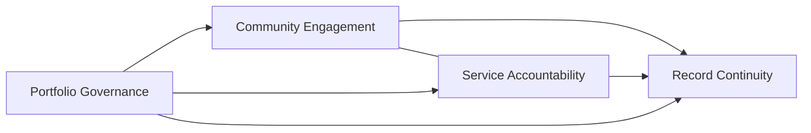

# Responsibility And Collaboration

This section describes how the building blocks **hand off work and depend on each other** inside EchoCorner. It stays above APIs and message shapes; chapter 10 holds integration patterns and collaboration contracts for the dossier, while this chapter stays one level above those specifics.

## Dependency Direction (Functional)

- **`Portfolio Governance`** is upstream of all other blocks for **current** `Administrator assignment` meaning.
- **`Community Engagement`** and **`Service Accountability`** are **peers**: they both consume assignment truth and community/owner vocabulary; they must not share one merged operational model for “interactions.”
- **`Record Continuity`** is downstream of all three operational blocks for **historical evidence**; it must not feed back reinterpretation of current responsibility or open support state.

This matches the chapter 09 context map: Customer/Supplier with Conformist behavior toward `Portfolio Governance`, Published Language between operational peers and toward continuity.

## Typical Collaborations

| From | To | Collaboration intent | Handoff idea (pre-technical) |
| --- | --- | --- | --- |
| `Portfolio Governance` | `Community Engagement` | Active assignment becomes available for eligibility and communication scope | “This community is under this administrator relationship now.” |
| `Portfolio Governance` | `Service Accountability` | Same assignment truth for accountable support ownership | “Support work for this community is owned under this relationship.” |
| `Portfolio Governance` | `Record Continuity` | Assignment transitions are evidence | “These assignment events occurred and are part of the historical narrative.” |
| `Community Engagement` | `Record Continuity` | Official communications and governed discussion leave durable traces | “These communication records are preserved with continuity meaning.” |
| `Service Accountability` | `Record Continuity` | Case lifecycle facts become historical evidence | “Support history is explainable after closure or reassignment.” |
| `Community Engagement` | `Service Accountability` | Cross-area facts when a support matter relates to communication | Exchange glossary-aligned references (e.g., community, record identifiers) without merging lifecycles |

## Anti-Patterns To Prevent Inside The Application

- **Shadow assignment state** in engagement or support areas
- **Using the continuity area** to infer who should act operationally today
- **Collapsing tickets and wall posts** into a single generic item type
- **Bypassing policy** for eligibility, classification, or retention by hard-coding special cases in multiple blocks

## Structurizr Alignment

Chapter 08 keeps the canonical Structurizr workspace at system landscape and system context. Chapter 11 does not introduce new C4 containers; it prepares coherent functional collaboration so a future container view can map cleanly to these handoffs.
